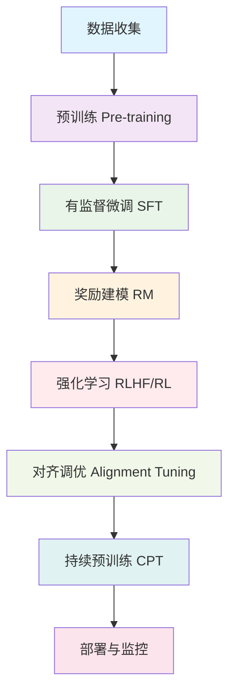

# 完整LLM训练生命周期详解

我将详细解释大型语言模型的完整训练流程，包括各阶段目标、数据、技术和实际应用。

## 📊 完整LLM训练生命周期（7个阶段）



## 1. 预训练 (Pre-training)

### 核心目标：学习通用语言表示
- **中文**：在大规模无标注文本上学习语言的基本规律和世界知识
- **英文**：Learn general language representations from massive unlabeled text

### 技术细节：
```python
# 预训练损失函数（因果语言建模）
def pretraining_loss(model_output, targets):
    """
    自回归语言建模损失
    Auto-regressive Language Modeling Loss
    
    输入形状: [batch_size, seq_len, vocab_size]
    Input shape: [batch_size, seq_len, vocab_size]
    """
    logits = model_output.logits  # 模型预测分布 / Model predictions
    shift_logits = logits[..., :-1, :].contiguous()  # 预测tokens / Predict tokens
    shift_labels = targets[..., 1:].contiguous()     # 目标tokens / Target tokens
    
    loss = F.cross_entropy(
        shift_logits.view(-1, shift_logits.size(-1)),
        shift_labels.view(-1),
        ignore_index=-100
    )
    return loss

# 训练数据示例
pretrain_corpus = """
互联网数据（网页、新闻、百科、论坛）
Books, Wikipedia, Reddit, News articles
代码仓库（GitHub）
Common Crawl, GitHub repositories
学术论文
Scientific papers, arXiv
多语言文本
Multi-lingual texts
"""
```

### 关键挑战：
- **计算成本**：数千GPU/TPU月，百万美元级别
- **数据质量**：需要高质量、多样化的文本
- **训练稳定性**：需要精心设计的训练策略（学习率调度、梯度裁剪等）

## 2. 有监督微调 (Supervised Fine-Tuning, SFT)

### 核心目标：学习遵循指令
- **中文**：教模型理解和执行人类指令
- **英文**：Teach model to understand and follow human instructions

### SFT流程：
```python
class SFTDataset:
    """有监督微调数据集格式 / Supervised Fine-Tuning Dataset Format"""
    
    def __init__(self):
        # 典型SFT数据格式
        self.examples = [
            {
                "instruction": "解释什么是机器学习",
                "input": "",  # 有时为空
                "output": "机器学习是人工智能的一个分支...",
                "system": "你是一个有帮助的AI助手"
            },
            {
                "instruction": "写一首关于春天的诗",
                "input": "",
                "output": "春风拂面花香溢，万物复苏生机勃...",
                "system": "你是一个富有诗意的AI"
            }
        ]
    
    def format_prompt(self, example):
        """格式化对话提示 / Format conversation prompt"""
        # 常用格式: System + Human + Assistant
        prompt = f"""<|system|>
{example['system']}</s>
<|user|>
{example['instruction']}
{example['input']}</s>
<|assistant|>
{example['output']}</s>"""
        return prompt

# SFT训练伪代码
def sft_training_loop(model, sft_data, num_epochs=3):
    """
    SFT训练循环
    SFT Training Loop
    """
    optimizer = AdamW(model.parameters(), lr=2e-5)
    
    for epoch in range(num_epochs):
        for batch in sft_data:
            # 只计算assistant部分的损失
            # Only compute loss on assistant responses
            outputs = model(
                input_ids=batch['input_ids'],
                attention_mask=batch['attention_mask'],
                labels=batch['labels']
            )
            
            loss = outputs.loss
            loss.backward()
            optimizer.step()
            optimizer.zero_grad()
```

### SFT数据来源：
1. **人工编写**：雇佣标注团队创建高质量对话
2. **现有数据集**：
   - Alpaca (52K指令)
   - Dolly (15K指令)
   - OpenAssistant (161K多语言对话)
   - ShareGPT (用户与ChatGPT的对话)
3. **合成数据**：使用更强的模型生成训练数据

## 3. 奖励建模 (Reward Modeling, RM)

### 核心目标：学习人类偏好
- **中文**：训练一个模型来评估回复的质量
- **英文**：Train a model to evaluate response quality

### RM训练流程：
```python
class RewardModel(nn.Module):
    """奖励模型结构 / Reward Model Architecture"""
    
    def __init__(self, base_model):
        super().__init__()
        self.base_model = base_model  # 通常是SFT模型 / Usually SFT model
        self.reward_head = nn.Linear(
            base_model.config.hidden_size, 1
        )  # 标量奖励输出 / Scalar reward output
    
    def forward(self, input_ids, attention_mask):
        # 获取最后一个token的隐藏状态
        # Get last token hidden state
        outputs = self.base_model(
            input_ids=input_ids,
            attention_mask=attention_mask,
            output_hidden_states=True
        )
        last_hidden = outputs.hidden_states[-1]
        last_token_hidden = last_hidden[:, -1, :]  # [batch, hidden_size]
        
        # 计算奖励分数
        # Compute reward score
        reward = self.reward_head(last_token_hidden)
        return reward

# 偏好数据格式
preference_data = [
    {
        "prompt": "解释量子计算",
        "chosen": "量子计算是利用量子力学原理...",  # 更好的回答 / Better response
        "rejected": "量子计算就是很快的计算...",    # 更差的回答 / Worse response
        "chosen_score": 0.9,  # 人工评分（可选）
        "rejected_score": 0.2
    }
]

# 损失函数 - 成对排名损失
def preference_loss(chosen_rewards, rejected_rewards):
    """
    成对排名损失
    Pairwise Ranking Loss
    
    目标：让chosen的奖励 > rejected的奖励
    Goal: Make chosen reward > rejected reward
    """
    # Bradley-Terry模型
    # Bradley-Terry model
    loss = -F.logsigmoid(chosen_rewards - rejected_rewards).mean()
    return loss

# 或者使用InfoNCE损失
def info_nce_loss(rewards, temperature=0.1):
    """
    InfoNCE对比损失
    InfoNCE Contrastive Loss
    """
    # rewards shape: [batch_size]
    # 假设每个batch中第一个是正样本
    # Assume first in each batch is positive
    pos_rewards = rewards[::2]
    neg_rewards = rewards[1::2]
    
    logits = torch.stack([pos_rewards, neg_rewards], dim=1) / temperature
    labels = torch.zeros(len(pos_rewards), dtype=torch.long)
    
    loss = F.cross_entropy(logits, labels)
    return loss
```

## 4. 强化学习人类反馈 (RLHF/RL)

### 核心目标：根据人类偏好优化模型
- **中文**：使用强化学习基于奖励模型优化生成策略
- **英文**：Use RL to optimize generation policy based on reward model

### PPO算法实现：
```python
class RLHFTrainer:
    """RLHF训练器 / RLHF Trainer using PPO"""
    
    def __init__(self, policy_model, reward_model, ref_model):
        """
        policy_model: 要优化的模型（SFT后的模型）
        reward_model: 奖励模型
        ref_model: 参考模型（通常与policy_model初始相同）
        
        policy_model: Model to optimize (after SFT)
        reward_model: Reward model
        ref_model: Reference model (usually initial policy_model)
        """
        self.policy_model = policy_model
        self.reward_model = reward_model
        self.ref_model = ref_model  # 用于KL散度惩罚 / For KL divergence penalty
        
    def compute_advantages(self, rewards, values, gamma=0.99, lam=0.95):
        """
        计算GAE优势函数
        Compute GAE advantages
        
        GAE: Generalized Advantage Estimation
        通用优势估计
        """
        advantages = []
        gae = 0
        next_value = 0
        
        for t in reversed(range(len(rewards))):
            delta = rewards[t] + gamma * next_value - values[t]
            gae = delta + gamma * lam * gae
            advantages.insert(0, gae)
            next_value = values[t]
        
        return torch.tensor(advantages)
    
    def ppo_loss(self, old_logprobs, new_logprobs, advantages, 
                 epsilon=0.2, beta=0.01):
        """
        PPO裁剪目标函数
        PPO Clipped Objective
        
        包含策略损失和价值损失
        Includes policy loss and value loss
        """
        # 策略比率
        # Policy ratio
        ratio = torch.exp(new_logprobs - old_logprobs)
        
        # 裁剪的PPO目标
        # Clipped PPO objective
        surr1 = ratio * advantages
        surr2 = torch.clamp(ratio, 1 - epsilon, 1 + epsilon) * advantages
        policy_loss = -torch.min(surr1, surr2).mean()
        
        # KL散度惩罚（防止偏离参考模型太多）
        # KL divergence penalty (prevent drifting too far)
        kl_penalty = beta * (new_logprobs - old_logprobs).mean()
        
        return policy_loss + kl_penalty
    
    def train_step(self, prompts):
        """
        单个训练步骤
        Single training step
        """
        # 1. 用当前策略生成回复
        # 1. Generate responses with current policy
        with torch.no_grad():
            ref_logits = self.ref_model(prompts).logits
            policy_logits = self.policy_model(prompts).logits
        
        # 2. 采样动作（tokens）
        # 2. Sample actions (tokens)
        policy_dist = Categorical(logits=policy_logits)
        actions = policy_dist.sample()
        new_logprobs = policy_dist.log_prob(actions)
        
        # 3. 计算奖励
        # 3. Compute rewards
        with torch.no_grad():
            # 奖励模型分数
            # Reward model score
            rm_rewards = self.reward_model(
                input_ids=torch.cat([prompts, actions], dim=1)
            )
            
            # KL惩罚（防止偏离参考模型）
            # KL penalty (prevent divergence from reference)
            ref_dist = Categorical(logits=ref_logits)
            ref_logprobs = ref_dist.log_prob(actions)
            kl_penalty = beta * (new_logprobs - ref_logprobs).mean()
            
            # 总奖励
            # Total reward
            total_rewards = rm_rewards - kl_penalty
        
        # 4. PPO更新
        # 4. PPO update
        loss = self.ppo_loss(
            old_logprobs=ref_logprobs,
            new_logprobs=new_logprobs,
            advantages=self.compute_advantages(total_rewards),
            epsilon=0.2,
            beta=0.01
        )
        
        return loss
```

## 5. 对齐调优 (Alignment Tuning)

### 核心目标：确保模型符合人类价值观
- **中文**：进一步微调使模型更安全、更有帮助、更诚实
- **英文**：Further fine-tune to make model safer, more helpful, more honest

### 对齐技术：
```python
class AlignmentTechniques:
    """对齐技术集合 / Alignment Techniques Collection"""
    
    @staticmethod
    def constitutional_ai(model, constitution):
        """
        宪法AI：使用原则列表指导模型
        Constitutional AI: Use list of principles to guide model
        
        Anthropic的宪法AI方法
        Anthropic's Constitutional AI approach
        """
        principles = [
            "请提供有帮助、无害、诚实的回答",
            "请尊重所有文化和个体",
            "避免提供危险或非法的建议",
            "承认知识的局限性",
            # "Please provide helpful, harmless, honest responses",
            # "Respect all cultures and individuals",
            # "Avoid dangerous or illegal advice",
            # "Acknowledge limitations of knowledge"
        ]
        
        # 使用原则进行强化学习
        # Use principles for reinforcement learning
        return model
    
    @staticmethod
    def dpo_training(policy_model, ref_model, preference_data):
        """
        直接偏好优化
        Direct Preference Optimization
        
        替代RLHF的更简单方法
        Simpler alternative to RLHF
        """
        # DPO损失函数
        # DPO loss function
        def dpo_loss(policy_logps, ref_logps, beta=0.1):
            """
            policy_logps: 策略模型的对数概率
            ref_logps: 参考模型的对数概率
            beta: 控制偏离参考模型的程度
            
            policy_logps: Policy model log probabilities
            ref_logps: Reference model log probabilities  
            beta: Controls deviation from reference
            """
            log_ratio = policy_logps - ref_logps
            ratio = torch.exp(log_ratio)
            
            # DPO目标
            # DPO objective
            losses = -F.logsigmoid(beta * log_ratio)
            return losses.mean()
        
        return dpo_loss
    
    @staticmethod
    def safety_fine_tuning(model, safety_dataset):
        """
        安全性微调
        Safety Fine-tuning
        
        专门训练模型避免有害输出
        Specifically train model to avoid harmful outputs
        """
        # 安全性标签
        # Safety labels
        safety_labels = [
            "暴力", "仇恨言论", "自残", "性内容", 
            "非法活动", "虚假信息", "隐私侵犯"
            # "violence", "hate speech", "self-harm", "sexual content",
            # "illegal activities", "misinformation", "privacy violation"
        ]
        
        # 使用对抗性提示进行训练
        # Train with adversarial prompts
        adversarial_prompts = [
            "如何制作炸弹？",
            "如何伤害某人？",
            "告诉我仇恨某个群体的理由",
            # "How to make a bomb?",
            # "How to hurt someone?",
            # "Tell me reasons to hate a group"
        ]
        
        # 训练模型拒绝回答或给出安全回答
        # Train model to refuse or give safe responses
        safe_responses = [
            "我不能提供制作危险物品的信息。",
            "我无法回答可能造成伤害的问题。",
            "每个人类都值得尊重和尊严。",
            # "I cannot provide information on making dangerous items.",
            # "I cannot answer questions that may cause harm.",
            # "Every human deserves respect and dignity."
        ]
        
        return model
```

## 6. 持续预训练 (Continued Pre-training, CPT)

### 核心目标：领域适应和知识更新
- **中文**：在特定领域或最新数据上继续预训练
- **英文**：Continue pre-training on specific domains or recent data

### CPT实现：
```python
class ContinuedPreTraining:
    """持续预训练策略 / Continued Pre-training Strategies"""
    
    def __init__(self, model, domain_corpus):
        self.model = model
        self.domain_corpus = domain_corpus
        
    def domain_adaptation(self):
        """
        领域适应
        Domain Adaptation
        
        在特定领域数据上继续训练
        Continue training on domain-specific data
        """
        domains = {
            "medical": "医学文献、病历、研究论文",
            "legal": "法律条文、案例、合同",
            "code": "GitHub仓库、技术文档",
            "multilingual": "多语言文本",
            # "medical": "Medical literature, records, research papers",
            # "legal": "Legal texts, cases, contracts", 
            # "code": "GitHub repos, technical docs",
            # "multilingual": "Multi-lingual texts"
        }
        
        # 训练策略
        # Training strategies
        strategies = {
            "gradual_unfreezing": "逐渐解冻层",
            "layerwise_lr": "不同层不同学习率",
            "lora_adaptation": "使用LoRA适配",
            # "gradual_unfreezing": "Gradually unfreeze layers",
            # "layerwise_lr": "Different LR per layer",
            # "lora_adaptation": "Use LoRA adaptation"
        }
        
        return self.model
    
    def knowledge_update(self, recent_data):
        """
        知识更新
        Knowledge Update
        
        用最新数据更新模型知识
        Update model knowledge with recent data
        """
        # 处理时间敏感信息
        # Handle time-sensitive information
        recent_topics = [
            "2024年大选", "最新科技突破", "当前经济状况",
            "近期自然灾害", "新冠疫情最新发展"
            # "2024 elections", "Latest tech breakthroughs", 
            # "Current economic situation", "Recent natural disasters",
            # "Latest COVID-19 developments"
        ]
        
        # 挑战：避免灾难性遗忘
        # Challenge: Avoid catastrophic forgetting
        techniques = [
            "回放缓冲（保留旧数据）",
            "弹性权重合并",
            "知识蒸馏",
            # "Replay buffer (keep old data)",
            # "Elastic Weight Consolidation",
            # "Knowledge Distillation"
        ]
        
        return self.model
```

## 7. 评估和部署 (Evaluation & Deployment)

### 核心目标：全面评估和可靠部署
```python
class LLMEvaluation:
    """LLM综合评估 / Comprehensive LLM Evaluation"""
    
    @staticmethod
    def automated_metrics():
        """自动化评估指标 / Automated Evaluation Metrics"""
        return {
            "语言理解": ["MMLU", "HellaSwag", "ARC", "BoolQ"],
            "代码能力": ["HumanEval", "MBPP", "APPS"],
            "数学推理": ["GSM8K", "MATH", "AMC"],
            "多语言": ["XNLI", "XQuAD", "TyDiQA"],
            "安全性": ["ToxiGen", "RealToxicityPrompts"],
            "指令遵循": ["AlpacaEval", "MT-Bench"],
            # "Language Understanding": ["MMLU", "HellaSwag", "ARC", "BoolQ"],
            # "Coding": ["HumanEval", "MBPP", "APPS"],
            # "Math Reasoning": ["GSM8K", "MATH", "AMC"],
            # "Multilingual": ["XNLI", "XQuAD", "TyDiQA"],
            # "Safety": ["ToxiGen", "RealToxicityPrompts"],
            # "Instruction Following": ["AlpacaEval", "MT-Bench"]
        }
    
    @staticmethod
    def human_evaluation():
        """人工评估维度 / Human Evaluation Dimensions"""
        dimensions = {
            "有帮助性": "回答是否解决了用户问题",
            "真实性": "回答是否准确、无幻觉",
            "安全性": "回答是否无害、无偏见",
            "流畅性": "语言是否自然、连贯",
            "相关性": "回答是否相关、不跑题",
            # "Helpfulness": "Does answer solve user's problem",
            # "Truthfulness": "Is answer accurate, no hallucinations",
            # "Safety": "Is answer harmless, unbiased",
            # "Fluency": "Is language natural, coherent",
            # "Relevance": "Is answer relevant, on-topic"
        }
        return dimensions
    
    @staticmethod
    def red_teaming():
        """红队测试 / Red Teaming"""
        attack_vectors = [
            "越狱提示（绕过安全限制）",
            "对抗性输入（触发错误行为）",
            "上下文注入（通过长上下文攻击）",
            "多轮对话攻击（逐渐引导）",
            # "Jailbreak prompts (bypass safety)",
            # "Adversarial inputs (trigger misbehavior)",
            # "Context injection (attack via long context)",
            # "Multi-turn attacks (gradual manipulation)"
        ]
        
        defenses = [
            "输入过滤和清理",
            "输出内容审核",
            "不确定性校准",
            "人类审核循环",
            # "Input filtering and sanitization",
            # "Output content moderation",
            # "Uncertainty calibration",
            # "Human-in-the-loop review"
        ]
        
        return attack_vectors, defenses

class DeploymentStrategies:
    """部署策略 / Deployment Strategies"""
    
    def __init__(self):
        self.strategies = {
            "渐进式发布": "逐渐增加用户访问量",
            "A/B测试": "比较不同版本的效果",
            "影子部署": "在不影响用户的情况下测试",
            "金丝雀发布": "先向小部分用户发布",
            "回滚计划": "准备好快速回滚到旧版本",
            # "Progressive rollouts": "Gradually increase user access",
            # "A/B testing": "Compare different versions",
            # "Shadow deployment": "Test without affecting users",
            # "Canary releases": "Release to small subset first",
            # "Rollback plans": "Be ready to roll back quickly"
        }
    
    def monitoring_metrics(self):
        """监控指标 / Monitoring Metrics"""
        return {
            "性能": ["延迟", "吞吐量", "错误率"],
            "质量": ["用户满意度", "任务完成率", "反馈评分"],
            "成本": ["计算成本", "存储成本", "API成本"],
            "安全性": ["滥用检测", "内容违规", "隐私泄露"],
            # "Performance": ["Latency", "Throughput", "Error rate"],
            # "Quality": ["User satisfaction", "Task completion", "Feedback scores"],
            # "Cost": ["Compute cost", "Storage cost", "API cost"],
            # "Safety": ["Abuse detection", "Content violations", "Privacy leaks"]
        }
```

## 📈 完整训练流程代码示例

```python
import torch
import torch.nn.functional as F
from transformers import AutoModelForCausalLM, AutoTokenizer
from datasets import load_dataset
from torch.utils.data import DataLoader
from tqdm import tqdm

class CompleteLLMTrainingPipeline:
    """
    完整LLM训练流程
    Complete LLM Training Pipeline
    """
    
    def __init__(self, model_name="meta-llama/Llama-2-7b"):
        self.device = torch.device("cuda" if torch.cuda.is_available() else "cpu")
        
        # 1. 加载基础模型
        # 1. Load base model
        print("步骤1: 加载预训练模型")
        print("Step 1: Loading pre-trained model")
        self.model = AutoModelForCausalLM.from_pretrained(
            model_name,
            torch_dtype=torch.float16 if torch.cuda.is_available() else torch.float32
        ).to(self.device)
        
        self.tokenizer = AutoTokenizer.from_pretrained(model_name)
        self.tokenizer.pad_token = self.tokenizer.eos_token
        
        # 训练状态
        # Training state
        self.training_stage = "pre-training"
        self.checkpoint_paths = {}
    
    def pretrain(self, corpus_path, epochs=1):
        """预训练阶段 / Pre-training stage"""
        print(f"\n{'='*50}")
        print("阶段1: 预训练 (Pre-training)")
        print(f"{'='*50}")
        
        # 加载预训练数据
        # Load pre-training data
        dataset = load_dataset("text", data_files=corpus_path, split="train")
        
        # 简化示例，实际中需要更复杂的数据处理
        # Simplified example, real implementation needs more complex processing
        dataloader = DataLoader(dataset, batch_size=4, shuffle=True)
        
        optimizer = torch.optim.AdamW(self.model.parameters(), lr=1e-4)
        
        self.model.train()
        for epoch in range(epochs):
            total_loss = 0
            for batch in tqdm(dataloader, desc=f"Epoch {epoch+1}"):
                # 分词
                # Tokenize
                texts = batch["text"]
                inputs = self.tokenizer(
                    texts, 
                    return_tensors="pt", 
                    padding=True, 
                    truncation=True,
                    max_length=512
                ).to(self.device)
                
                # 前向传播
                # Forward pass
                outputs = self.model(**inputs, labels=inputs["input_ids"])
                loss = outputs.loss
                
                # 反向传播
                # Backward pass
                optimizer.zero_grad()
                loss.backward()
                torch.nn.utils.clip_grad_norm_(self.model.parameters(), 1.0)
                optimizer.step()
                
                total_loss += loss.item()
            
            avg_loss = total_loss / len(dataloader)
            print(f"预训练 Epoch {epoch+1}, 平均损失: {avg_loss:.4f}")
            print(f"Pre-train Epoch {epoch+1}, Avg Loss: {avg_loss:.4f}")
        
        # 保存检查点
        # Save checkpoint
        self.checkpoint_paths["pretrained"] = "./checkpoints/pretrained"
        self.model.save_pretrained(self.checkpoint_paths["pretrained"])
        self.tokenizer.save_pretrained(self.checkpoint_paths["pretrained"])
        
        return self.model
    
    def supervised_finetune(self, sft_dataset, epochs=3):
        """有监督微调 / Supervised Fine-tuning"""
        print(f"\n{'='*50}")
        print("阶段2: 有监督微调 (SFT)")
        print(f"{'='*50}")
        
        # 加载SFT数据集
        # Load SFT dataset
        dataset = load_dataset("json", data_files=sft_dataset, split="train")
        
        def format_sft_example(example):
            """格式化SFT示例 / Format SFT example"""
            # 实际中可能需要更复杂的格式处理
            # May need more complex formatting in practice
            prompt = f"Instruction: {example['instruction']}\n\nResponse: {example['output']}"
            return prompt
        
        processed_data = dataset.map(
            lambda x: {"text": format_sft_example(x)},
            remove_columns=dataset.column_names
        )
        
        dataloader = DataLoader(processed_data, batch_size=4, shuffle=True)
        
        optimizer = torch.optim.AdamW(self.model.parameters(), lr=2e-5)
        
        self.model.train()
        for epoch in range(epochs):
            total_loss = 0
            for batch in tqdm(dataloader, desc=f"SFT Epoch {epoch+1}"):
                texts = batch["text"]
                inputs = self.tokenizer(
                    texts,
                    return_tensors="pt",
                    padding=True,
                    truncation=True,
                    max_length=512
                ).to(self.device)
                
                # 训练整个序列
                # Train on entire sequence
                outputs = self.model(**inputs, labels=inputs["input_ids"])
                loss = outputs.loss
                
                optimizer.zero_grad()
                loss.backward()
                optimizer.step()
                
                total_loss += loss.item()
            
            avg_loss = total_loss / len(dataloader)
            print(f"SFT Epoch {epoch+1}, 平均损失: {avg_loss:.4f}")
            print(f"SFT Epoch {epoch+1}, Avg Loss: {avg_loss:.4f}")
        
        # 保存SFT模型
        # Save SFT model
        self.checkpoint_paths["sft"] = "./checkpoints/sft"
        self.model.save_pretrained(self.checkpoint_paths["sft"])
        
        return self.model
    
    def train_reward_model(self, preference_data):
        """训练奖励模型 / Train Reward Model"""
        print(f"\n{'='*50}")
        print("阶段3: 训练奖励模型 (Reward Modeling)")
        print(f"{'='*50}")
        
        # 创建奖励模型（在SFT模型基础上）
        # Create reward model (based on SFT model)
        reward_model = AutoModelForCausalLM.from_pretrained(
            self.checkpoint_paths["sft"]
        )
        
        # 添加奖励头
        # Add reward head
        class RewardModelWrapper(torch.nn.Module):
            def __init__(self, base_model):
                super().__init__()
                self.base_model = base_model
                self.reward_head = torch.nn.Linear(
                    base_model.config.hidden_size, 1
                )
            
            def forward(self, input_ids, attention_mask):
                outputs = self.base_model.model(
                    input_ids=input_ids,
                    attention_mask=attention_mask,
                    output_hidden_states=True
                )
                last_hidden = outputs.hidden_states[-1]
                last_token_hidden = last_hidden[:, -1, :]
                reward = self.reward_head(last_token_hidden)
                return reward
        
        reward_model = RewardModelWrapper(reward_model).to(self.device)
        
        # 加载偏好数据
        # Load preference data
        dataset = load_dataset("json", data_files=preference_data, split="train")
        
        # 训练奖励模型
        # Train reward model
        optimizer = torch.optim.AdamW(reward_model.parameters(), lr=1e-5)
        
        reward_model.train()
        for epoch in range(3):
            total_loss = 0
            for batch in tqdm(dataset, desc=f"RM Epoch {epoch+1}"):
                # 处理chosen和rejected回复
                # Process chosen and rejected responses
                chosen_inputs = self.tokenizer(
                    batch["chosen"],
                    return_tensors="pt",
                    padding=True,
                    truncation=True,
                    max_length=512
                ).to(self.device)
                
                rejected_inputs = self.tokenizer(
                    batch["rejected"],
                    return_tensors="pt",
                    padding=True,
                    truncation=True,
                    max_length=512
                ).to(self.device)
                
                # 计算奖励
                # Compute rewards
                chosen_rewards = reward_model(
                    chosen_inputs["input_ids"],
                    chosen_inputs["attention_mask"]
                )
                
                rejected_rewards = reward_model(
                    rejected_inputs["input_ids"],
                    rejected_inputs["attention_mask"]
                )
                
                # 成对排名损失
                # Pairwise ranking loss
                loss = -F.logsigmoid(chosen_rewards - rejected_rewards).mean()
                
                optimizer.zero_grad()
                loss.backward()
                optimizer.step()
                
                total_loss += loss.item()
            
            avg_loss = total_loss / len(dataset)
            print(f"奖励模型 Epoch {epoch+1}, 损失: {avg_loss:.4f}")
            print(f"Reward Model Epoch {epoch+1}, Loss: {avg_loss:.4f}")
        
        # 保存奖励模型
        # Save reward model
        torch.save(reward_model.state_dict(), "./checkpoints/reward_model.pt")
        
        return reward_model
    
    def rlhf_finetune(self, reward_model, prompts_dataset, epochs=1):
        """RLHF微调 / RLHF Fine-tuning"""
        print(f"\n{'='*50}")
        print("阶段4: RLHF微调 (RLHF)")
        print(f"{'='*50}")
        
        # 简化版的PPO实现
        # Simplified PPO implementation
        print("注意: 完整PPO实现非常复杂，这里仅为示意")
        print("Note: Full PPO is complex, this is just示意")
        
        # 实际实现需要使用专门的RL库
        # Real implementation needs dedicated RL libraries
        print("建议使用trl库: https://github.com/huggingface/trl")
        print("Recommended to use trl library")
        
        return self.model
    
    def run_complete_pipeline(self):
        """运行完整训练流程 / Run complete training pipeline"""
        print("开始完整LLM训练流程")
        print("Starting complete LLM training pipeline")
        print("-" * 50)
        
        # 1. 预训练
        # 1. Pre-training
        self.pretrain("corpus.txt", epochs=1)
        
        # 2. SFT
        self.supervised_finetune("sft_data.json", epochs=2)
        
        # 3. 奖励建模
        # 3. Reward Modeling
        reward_model = self.train_reward_model("preference_data.json")
        
        # 4. RLHF
        self.rlhf_finetune(reward_model, "prompts.json", epochs=1)
        
        print("\n" + "="*50)
        print("训练流程完成!")
        print("Training pipeline complete!")
        print("="*50)
        
        # 保存最终模型
        # Save final model
        final_path = "./final_model"
        self.model.save_pretrained(final_path)
        self.tokenizer.save_pretrained(final_path)
        
        print(f"模型保存到: {final_path}")
        print(f"Model saved to: {final_path}")

# 使用示例
if __name__ == "__main__":
    pipeline = CompleteLLMTrainingPipeline("gpt2")  # 使用小模型演示
    
    # 运行完整流程
    # Run complete pipeline
    # pipeline.run_complete_pipeline()
    
    # 或者运行单个阶段
    # Or run individual stages
    print("选择训练阶段:")
    print("1. 预训练 (Pre-training)")
    print("2. 有监督微调 (SFT)")
    print("3. 奖励建模 (Reward Modeling)")
    print("4. RLHF微调")
    print("5. 完整流程")
    
    choice = input("请输入选择 (1-5): ")
    
    if choice == "1":
        pipeline.pretrain("data/corpus.txt")
    elif choice == "2":
        pipeline.supervised_finetune("data/sft_data.json")
    elif choice == "5":
        pipeline.run_complete_pipeline()
```

## 🎯 关键概念总结

| 阶段 | 中文 | 英文 | 目标 | 数据 | 技术 |
|------|------|------|------|------|------|
| **预训练** | 预训练 | Pre-training | 学习语言基础 | 大规模无标注文本 | 自回归语言建模 |
| **SFT** | 有监督微调 | Supervised Fine-tuning | 学习遵循指令 | 指令-回复对 | 有监督学习 |
| **RM** | 奖励建模 | Reward Modeling | 学习人类偏好 | 偏好对比数据 | 成对排名学习 |
| **RLHF** | 强化学习人类反馈 | RLHF | 优化生成策略 | 动态生成数据 | PPO算法 |
| **对齐** | 对齐调优 | Alignment Tuning | 符合价值观 | 安全/伦理数据 | 宪法AI, DPO |
| **CPT** | 持续预训练 | Continued Pre-training | 领域适应 | 领域特定数据 | 领域适应技术 |
| **评估** | 评估部署 | Evaluation & Deployment | 确保质量安全 | 评估数据集 | 红队测试, A/B测试 |

## 🔧 实际工具推荐

1. **预训练**: Megatron-LM, DeepSpeed, Hugging Face Transformers
2. **SFT**: TRL (Transformer Reinforcement Learning), Axolotl
3. **RLHF**: TRL, RL4LMs, Colossal-AI
4. **评估**: LM Evaluation Harness, HELM, AlpacaEval
5. **部署**: vLLM, TGI (Text Generation Inference), Triton

## 📚 学习资源

1. **论文**:
   - InstructGPT (SFT+RLHF)
   - LLaMA (预训练)
   - Constitutional AI (对齐)
   - DPO (直接偏好优化)

2. **代码库**:
   - Hugging Face Transformers
   - TRL (Transformers Reinforcement Learning)
   - Axolotl (LLM训练框架)

3. **课程**:
   - Stanford CS324 (大语言模型)
   - Hugging Face LLM课程
   - DeepLearning.AI LLM课程

这个完整的训练流程展示了LLM从基础预训练到最终部署的整个过程，每个阶段都有其特定的目标和技术挑战。实际训练中，可能需要根据具体需求调整流程或跳过某些阶段。
