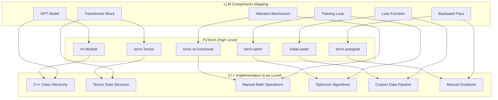

# PyTorch与C++底层实现对照表

我将提供一个详细的映射表，展示PyTorch高级API与底层C++实现的对应关系，帮助你理解从高层到底层的完整栈。

## 📊 完整映射关系表



## 1. 基础数据结构映射

### 1.1 Tensor类：PyTorch vs C++

```python
# Python/PyTorch 高级API
import torch

# 创建张量
x = torch.tensor([[1, 2], [3, 4]], dtype=torch.float32)
y = torch.randn(2, 3, requires_grad=True)

# 张量操作
z = x @ y.T  # 矩阵乘法
z.backward()  # 自动微分
```

```cpp
// C++底层实现
class Tensor {
public:
    // 数据存储
    std::vector<float> data;
    std::vector<size_t> shape;
    
    // 梯度信息
    std::vector<float> grad;
    bool requires_grad;
    
    // 构造函数
    Tensor(const std::vector<size_t>& shape_vec, bool requires_grad = false) {
        shape = shape_vec;
        requires_grad = requires_grad;
        
        // 分配内存
        size_t total_size = 1;
        for (size_t dim : shape) total_size *= dim;
        data.resize(total_size, 0.0f);
        
        if (requires_grad) {
            grad.resize(total_size, 0.0f);
        }
    }
    
    // 矩阵乘法（简化版）
    Tensor matmul(const Tensor& other) {
        // 实现矩阵乘法
        Tensor result({shape[0], other.shape[1]});
        
        for (size_t i = 0; i < shape[0]; i++) {
            for (size_t j = 0; j < other.shape[1]; j++) {
                float sum = 0.0f;
                for (size_t k = 0; k < shape[1]; k++) {
                    size_t idx1 = i * shape[1] + k;
                    size_t idx2 = k * other.shape[1] + j;
                    sum += data[idx1] * other.data[idx2];
                }
                result.data[i * result.shape[1] + j] = sum;
            }
        }
        
        return result;
    }
};
```

### 1.2 PyTorch张量操作与底层C++的映射

```python
# PyTorch张量操作
class PyTorchOperations:
    """PyTorch高级API操作示例"""
    
    @staticmethod
    def tensor_operations():
        # 1. 创建和初始化
        x = torch.zeros(2, 3)          # 对应C++: Tensor({2, 3}, data全0)
        y = torch.ones(2, 3)           # 对应C++: Tensor({2, 3}, data全1)
        z = torch.randn(2, 3)          # 对应C++: Tensor({2, 3}, 随机初始化)
        
        # 2. 形状操作
        x_reshaped = x.view(3, 2)      # 对应C++: x.reshape({3, 2})
        x_transposed = x.t()           # 对应C++: x.transpose()
        x_flattened = x.flatten()      # 对应C++: x.reshape({x.numel()})
        
        # 3. 数学运算
        add_result = x + y             # 对应C++: add_tensors(x, y)
        mul_result = x * y             # 对应C++: elementwise_mul(x, y)
        matmul_result = x @ y.T        # 对应C++: x.matmul(y.transpose())
        
        # 4. 归约操作
        sum_all = x.sum()              # 对应C++: x.sum_all()
        sum_dim0 = x.sum(dim=0)        # 对应C++: x.sum_along_dim(0)
        mean_val = x.mean()            # 对应C++: x.mean()
        
        return locals()
```

```cpp
// C++底层实现
class TensorOperations {
public:
    // 1. 创建和初始化
    static Tensor zeros(const std::vector<size_t>& shape) {
        Tensor tensor(shape);
        std::fill(tensor.data.begin(), tensor.data.end(), 0.0f);
        return tensor;
    }
    
    static Tensor ones(const std::vector<size_t>& shape) {
        Tensor tensor(shape);
        std::fill(tensor.data.begin(), tensor.data.end(), 1.0f);
        return tensor;
    }
    
    static Tensor randn(const std::vector<size_t>& shape) {
        Tensor tensor(shape);
        std::random_device rd;
        std::mt19937 gen(rd());
        std::normal_distribution<float> dist(0.0f, 1.0f);
        
        for (float& val : tensor.data) {
            val = dist(gen);
        }
        return tensor;
    }
    
    // 2. 形状操作
    static Tensor reshape(const Tensor& x, const std::vector<size_t>& new_shape) {
        size_t total_elements = 1;
        for (size_t dim : new_shape) total_elements *= dim;
        
        if (total_elements != x.numel()) {
            throw std::runtime_error("Reshape dimensions mismatch");
        }
        
        Tensor result = x;  // 浅拷贝数据
        result.shape = new_shape;
        return result;
    }
    
    static Tensor transpose(const Tensor& x) {
        // 2D转置
        if (x.shape.size() != 2) {
            throw std::runtime_error("Transpose requires 2D tensor");
        }
        
        Tensor result({x.shape[1], x.shape[0]});
        
        for (size_t i = 0; i < x.shape[0]; i++) {
            for (size_t j = 0; j < x.shape[1]; j++) {
                size_t src_idx = i * x.shape[1] + j;
                size_t dst_idx = j * x.shape[0] + i;
                result.data[dst_idx] = x.data[src_idx];
            }
        }
        
        return result;
    }
    
    // 3. 数学运算
    static Tensor add(const Tensor& a, const Tensor& b) {
        if (a.shape != b.shape) {
            throw std::runtime_error("Tensor shapes must match for addition");
        }
        
        Tensor result(a.shape);
        for (size_t i = 0; i < a.data.size(); i++) {
            result.data[i] = a.data[i] + b.data[i];
        }
        return result;
    }
    
    static Tensor elementwise_mul(const Tensor& a, const Tensor& b) {
        if (a.shape != b.shape) {
            throw std::runtime_error("Tensor shapes must match for multiplication");
        }
        
        Tensor result(a.shape);
        for (size_t i = 0; i < a.data.size(); i++) {
            result.data[i] = a.data[i] * b.data[i];
        }
        return result;
    }
    
    // 4. 归约操作
    static float sum_all(const Tensor& x) {
        float total = 0.0f;
        for (float val : x.data) {
            total += val;
        }
        return total;
    }
    
    static Tensor sum_along_dim(const Tensor& x, size_t dim) {
        // 沿着指定维度求和
        std::vector<size_t> new_shape = x.shape;
        new_shape.erase(new_shape.begin() + dim);
        
        Tensor result(new_shape);
        
        // 计算索引映射
        // 这里简化实现，实际需要更复杂的索引计算
        return result;
    }
    
    static float mean(const Tensor& x) {
        return sum_all(x) / x.numel();
    }
};
```

## 2. 神经网络层映射

### 2.1 Module基类：PyTorch vs C++

```python
# PyTorch的nn.Module
import torch.nn as nn
import torch.nn.functional as F

class PyTorchLayer(nn.Module):
    """PyTorch中的层实现"""
    
    def __init__(self, in_features, out_features):
        super().__init__()
        self.weight = nn.Parameter(torch.randn(out_features, in_features))
        self.bias = nn.Parameter(torch.zeros(out_features))
        
    def forward(self, x):
        # 前向传播
        return F.linear(x, self.weight, self.bias)
    
    def parameters(self):
        # 返回所有参数
        return [self.weight, self.bias]
```

```cpp
// C++中的层基类
class Layer {
protected:
    std::vector<Tensor> parameters;
    std::string name;
    bool training_mode;
    
public:
    Layer(const std::string& layer_name = "") 
        : name(layer_name), training_mode(true) {}
    
    virtual ~Layer() = default;
    
    // 前向传播 - 纯虚函数
    virtual Tensor forward(const Tensor& input) = 0;
    
    // 反向传播 - 简化版
    virtual void backward(const Tensor& grad_output) {
        // 在实际实现中，这里会计算参数的梯度
        for (auto& param : parameters) {
            if (param.requires_grad) {
                // 计算参数的梯度
                compute_parameter_gradients(param, grad_output);
            }
        }
    }
    
    // 获取参数
    std::vector<Tensor*> get_parameters() {
        std::vector<Tensor*> param_ptrs;
        for (auto& param : parameters) {
            param_ptrs.push_back(&param);
        }
        return param_ptrs;
    }
    
    // 训练/评估模式切换
    void train() { training_mode = true; }
    void eval() { training_mode = false; }
    
protected:
    void compute_parameter_gradients(Tensor& param, const Tensor& grad_output) {
        // 参数梯度计算的简化实现
        // 实际中需要根据具体层类型实现
    }
};
```

### 2.2 线性层实现对比

```python
# PyTorch线性层
class PyTorchLinear(nn.Module):
    """PyTorch线性层实现"""
    
    def __init__(self, in_features, out_features, bias=True):
        super().__init__()
        self.in_features = in_features
        self.out_features = out_features
        
        # 参数初始化
        self.weight = nn.Parameter(torch.Tensor(out_features, in_features))
        if bias:
            self.bias = nn.Parameter(torch.Tensor(out_features))
        else:
            self.register_parameter('bias', None)
        
        self.reset_parameters()
    
    def reset_parameters(self):
        # Kaiming初始化
        nn.init.kaiming_uniform_(self.weight, a=math.sqrt(5))
        if self.bias is not None:
            fan_in, _ = nn.init._calculate_fan_in_and_fan_out(self.weight)
            bound = 1 / math.sqrt(fan_in) if fan_in > 0 else 0
            nn.init.uniform_(self.bias, -bound, bound)
    
    def forward(self, input):
        # 使用torch.matmul实现
        output = input.matmul(self.weight.t())
        if self.bias is not None:
            output += self.bias
        return output
    
    def extra_repr(self):
        return f'in_features={self.in_features}, out_features={self.out_features}, bias={self.bias is not None}'
```

```cpp
// C++线性层实现
class LinearLayer : public Layer {
private:
    size_t in_features;
    size_t out_features;
    Tensor weight;
    Tensor bias;
    bool use_bias;
    
public:
    LinearLayer(size_t in_dim, size_t out_dim, bool has_bias = true)
        : Layer("Linear"), 
          in_features(in_dim), 
          out_features(out_dim),
          use_bias(has_bias) {
        
        // 初始化权重
        weight = Tensor({out_features, in_features}, true);
        initialize_weights(weight);
        parameters.push_back(weight);
        
        // 初始化偏置
        if (use_bias) {
            bias = Tensor({out_features}, true);
            std::fill(bias.data.begin(), bias.data.end(), 0.0f);
            parameters.push_back(bias);
        }
    }
    
    void initialize_weights(Tensor& w) {
        // Kaiming/He初始化
        float gain = sqrt(2.0f);  // ReLU的推荐增益
        float std = gain * sqrt(2.0f / (in_features + out_features));
        
        std::normal_distribution<float> dist(0.0f, std);
        std::random_device rd;
        std::mt19937 gen(rd());
        
        for (float& val : w.data) {
            val = dist(gen);
        }
    }
    
    Tensor forward(const Tensor& input) override {
        // input shape: [batch_size, seq_len, in_features] 或 [batch_size, in_features]
        // weight shape: [out_features, in_features]
        
        size_t batch_size = input.shape[0];
        size_t seq_len = (input.shape.size() > 2) ? input.shape[1] : 1;
        
        // 计算输出形状
        std::vector<size_t> output_shape;
        if (input.shape.size() == 3) {
            output_shape = {batch_size, seq_len, out_features};
        } else {
            output_shape = {batch_size, out_features};
        }
        
        Tensor output(output_shape);
        
        // 矩阵乘法: input * weight^T
        for (size_t b = 0; b < batch_size; b++) {
            for (size_t s = 0; s < seq_len; s++) {
                for (size_t o = 0; o < out_features; o++) {
                    float sum = 0.0f;
                    
                    for (size_t i = 0; i < in_features; i++) {
                        // 获取输入值
                        float input_val;
                        if (input.shape.size() == 3) {
                            input_val = input[{b, s, i}];
                        } else {
                            input_val = input[{b, i}];
                        }
                        
                        // 获取权重值
                        float weight_val = weight[{o, i}];
                        
                        sum += input_val * weight_val;
                    }
                    
                    // 添加偏置
                    if (use_bias) {
                        sum += bias.data[o];
                    }
                    
                    // 存储输出
                    if (output_shape.size() == 3) {
                        output[{b, s, o}] = sum;
                    } else {
                        output[{b, o}] = sum;
                    }
                }
            }
        }
        
        return output;
    }
    
    void backward(const Tensor& grad_output) override {
        // 计算权重的梯度
        if (weight.requires_grad) {
            // dL/dW = X^T * dL/dY
            compute_weight_gradients(grad_output);
        }
        
        // 计算偏置的梯度
        if (use_bias && bias.requires_grad) {
            compute_bias_gradients(grad_output);
        }
    }
    
private:
    void compute_weight_gradients(const Tensor& grad_output) {
        // 这里需要保存输入以计算梯度
        // 实际实现中，forward方法需要保存输入
    }
    
    void compute_bias_gradients(const Tensor& grad_output) {
        // 偏置的梯度是grad_output沿batch维度的和
    }
};
```

## 3. Transformer层映射

### 3.1 多头注意力实现对比

```python
# PyTorch多头注意力
class PyTorchMultiheadAttention(nn.Module):
    """PyTorch风格的多头注意力"""
    
    def __init__(self, embed_dim, num_heads, dropout=0.0, bias=True):
        super().__init__()
        self.embed_dim = embed_dim
        self.num_heads = num_heads
        self.head_dim = embed_dim // num_heads
        
        assert self.head_dim * num_heads == embed_dim, "embed_dim必须能被num_heads整除"
        
        # 线性变换层
        self.q_proj = nn.Linear(embed_dim, embed_dim, bias=bias)
        self.k_proj = nn.Linear(embed_dim, embed_dim, bias=bias)
        self.v_proj = nn.Linear(embed_dim, embed_dim, bias=bias)
        self.out_proj = nn.Linear(embed_dim, embed_dim, bias=bias)
        
        self.dropout = nn.Dropout(dropout)
        
    def forward(self, query, key, value, key_padding_mask=None, 
                need_weights=True, attn_mask=None):
        # 输入形状: [seq_len, batch_size, embed_dim] 或 [batch_size, seq_len, embed_dim]
        
        batch_size = query.size(1) if query.dim() == 3 else query.size(0)
        tgt_len = query.size(0) if query.dim() == 3 else query.size(1)
        src_len = key.size(0) if key.dim() == 3 else key.size(1)
        
        # 线性投影
        q = self.q_proj(query)
        k = self.k_proj(key)
        v = self.v_proj(value)
        
        # 重塑为多头格式
        q = self._reshape_to_heads(q, batch_size, tgt_len)
        k = self._reshape_to_heads(k, batch_size, src_len)
        v = self._reshape_to_heads(v, batch_size, src_len)
        
        # 计算注意力分数
        attn_output_weights = torch.matmul(q, k.transpose(-2, -1)) / math.sqrt(self.head_dim)
        
        # 应用掩码
        if attn_mask is not None:
            attn_output_weights += attn_mask
            
        if key_padding_mask is not None:
            attn_output_weights = attn_output_weights.masked_fill(
                key_padding_mask.unsqueeze(1).unsqueeze(2),
                float('-inf')
            )
        
        # Softmax
        attn_output_weights = F.softmax(attn_output_weights, dim=-1)
        attn_output_weights = self.dropout(attn_output_weights)
        
        # 注意力加权
        attn_output = torch.matmul(attn_output_weights, v)
        
        # 重塑回原始形状
        attn_output = self._reshape_from_heads(attn_output, batch_size, tgt_len)
        
        # 输出投影
        attn_output = self.out_proj(attn_output)
        
        if need_weights:
            return attn_output, attn_output_weights
        else:
            return attn_output
    
    def _reshape_to_heads(self, x, batch_size, seq_len):
        # 重塑为 [batch_size, num_heads, seq_len, head_dim]
        if x.dim() == 3:  # [seq_len, batch_size, embed_dim]
            x = x.transpose(0, 1)  # [batch_size, seq_len, embed_dim]
        
        x = x.view(batch_size, seq_len, self.num_heads, self.head_dim)
        x = x.transpose(1, 2)  # [batch_size, num_heads, seq_len, head_dim]
        return x
    
    def _reshape_from_heads(self, x, batch_size, seq_len):
        # 从多头格式重塑回来
        x = x.transpose(1, 2)  # [batch_size, seq_len, num_heads, head_dim]
        x = x.contiguous().view(batch_size, seq_len, self.embed_dim)
        
        # 如果需要，转置回 [seq_len, batch_size, embed_dim]
        # 这里我们保持 [batch_size, seq_len, embed_dim]
        return x
```

```cpp
// C++多头注意力实现
class MultiHeadAttention : public Layer {
private:
    size_t d_model;
    size_t num_heads;
    size_t d_k;
    size_t d_v;
    
    LinearLayer W_q;
    LinearLayer W_k;
    LinearLayer W_v;
    LinearLayer W_o;
    
    float dropout_rate;
    Tensor dropout_mask;
    
public:
    MultiHeadAttention(size_t model_dim, size_t n_heads, float dropout = 0.1f)
        : Layer("MultiHeadAttention"),
          d_model(model_dim),
          num_heads(n_heads),
          d_k(model_dim / n_heads),
          d_v(model_dim / n_heads),
          W_q(model_dim, model_dim, true),
          W_k(model_dim, model_dim, true),
          W_v(model_dim, model_dim, true),
          W_o(model_dim, model_dim, true),
          dropout_rate(dropout) {
        
        // 验证维度
        if (d_k * num_heads != model_dim) {
            throw std::runtime_error("model_dim must be divisible by num_heads");
        }
        
        // 收集所有参数
        auto q_params = W_q.get_parameters();
        auto k_params = W_k.get_parameters();
        auto v_params = W_v.get_parameters();
        auto o_params = W_o.get_parameters();
        
        // 添加到参数列表
        parameters.insert(parameters.end(), q_params.begin(), q_params.end());
        parameters.insert(parameters.end(), k_params.begin(), k_params.end());
        parameters.insert(parameters.end(), v_params.begin(), v_params.end());
        parameters.insert(parameters.end(), o_params.begin(), o_params.end());
    }
    
    Tensor forward(const Tensor& x, const Tensor& mask = Tensor()) override {
        // x shape: [batch_size, seq_len, d_model]
        size_t batch_size = x.shape[0];
        size_t seq_len = x.shape[1];
        
        // 1. 线性投影
        Tensor Q = W_q.forward(x);  // [batch, seq, d_model]
        Tensor K = W_k.forward(x);
        Tensor V = W_v.forward(x);
        
        // 2. 重塑为多头格式
        Tensor Q_heads = reshape_to_heads(Q, batch_size, seq_len);  // [batch, heads, seq, d_k]
        Tensor K_heads = reshape_to_heads(K, batch_size, seq_len);
        Tensor V_heads = reshape_to_heads(V, batch_size, seq_len);
        
        // 3. 计算注意力分数
        Tensor attn_scores = compute_attention_scores(Q_heads, K_heads);
        
        // 4. 应用掩码
        if (mask.numel() > 0) {
            apply_attention_mask(attn_scores, mask);
        }
        
        // 5. Softmax
        Tensor attn_weights = softmax_attention(attn_scores);
        
        // 6. Dropout（训练时）
        if (training_mode && dropout_rate > 0.0f) {
            attn_weights = apply_dropout(attn_weights, dropout_rate);
        }
        
        // 7. 注意力加权
        Tensor attn_output = apply_attention(attn_weights, V_heads);
        
        // 8. 重塑回原始形状
        Tensor output = reshape_from_heads(attn_output, batch_size, seq_len);
        
        // 9. 输出投影
        output = W_o.forward(output);
        
        return output;
    }
    
private:
    Tensor reshape_to_heads(const Tensor& x, size_t batch_size, size_t seq_len) {
        // 从 [batch, seq, d_model] 重塑为 [batch, heads, seq, d_k]
        Tensor heads({batch_size, num_heads, seq_len, d_k});
        
        for (size_t b = 0; b < batch_size; b++) {
            for (size_t h = 0; h < num_heads; h++) {
                for (size_t s = 0; s < seq_len; s++) {
                    for (size_t d = 0; d < d_k; d++) {
                        size_t src_idx = h * d_k + d;
                        heads[{b, h, s, d}] = x[{b, s, src_idx}];
                    }
                }
            }
        }
        
        return heads;
    }
    
    Tensor compute_attention_scores(const Tensor& Q, const Tensor& K) {
        // Q, K shape: [batch, heads, seq_q, d_k]
        size_t batch_size = Q.shape[0];
        size_t num_heads = Q.shape[1];
        size_t seq_len_q = Q.shape[2];
        size_t seq_len_k = K.shape[2];
        
        Tensor scores({batch_size, num_heads, seq_len_q, seq_len_k});
        
        float scale_factor = 1.0f / sqrt(static_cast<float>(d_k));
        
        // 计算缩放点积
        for (size_t b = 0; b < batch_size; b++) {
            for (size_t h = 0; h < num_heads; h++) {
                for (size_t i = 0; i < seq_len_q; i++) {
                    for (size_t j = 0; j < seq_len_k; j++) {
                        float score = 0.0f;
                        
                        for (size_t k = 0; k < d_k; k++) {
                            score += Q[{b, h, i, k}] * K[{b, h, j, k}];
                        }
                        
                        scores[{b, h, i, j}] = score * scale_factor;
                    }
                }
            }
        }
        
        return scores;
    }
    
    void apply_attention_mask(Tensor& scores, const Tensor& mask) {
        // 应用因果掩码（下三角）或其他掩码
        size_t batch_size = scores.shape[0];
        size_t num_heads = scores.shape[1];
        size_t seq_len_q = scores.shape[2];
        size_t seq_len_k = scores.shape[3];
        
        for (size_t b = 0; b < batch_size; b++) {
            for (size_t h = 0; h < num_heads; h++) {
                for (size_t i = 0; i < seq_len_q; i++) {
                    for (size_t j = 0; j < seq_len_k; j++) {
                        // 因果掩码：j > i 的位置设为负无穷
                        if (j > i) {
                            scores[{b, h, i, j}] = -1e9f;
                        }
                        
                        // 应用自定义掩码
                        if (mask.numel() > 0) {
                            if (mask.shape.size() == 2) {
                                if (mask[{i, j}] == 0.0f) {
                                    scores[{b, h, i, j}] = -1e9f;
                                }
                            } else if (mask.shape.size() == 3) {
                                if (mask[{b, i, j}] == 0.0f) {
                                    scores[{b, h, i, j}] = -1e9f;
                                }
                            }
                        }
                    }
                }
            }
        }
    }
    
    Tensor softmax_attention(const Tensor& scores) {
        // 沿最后一个维度进行softmax
        size_t batch_size = scores.shape[0];
        size_t num_heads = scores.shape[1];
        size_t seq_len_q = scores.shape[2];
        size_t seq_len_k = scores.shape[3];
        
        Tensor weights(scores.shape);
        
        for (size_t b = 0; b < batch_size; b++) {
            for (size_t h = 0; h < num_heads; h++) {
                for (size_t i = 0; i < seq_len_q; i++) {
                    // 找到最大值（数值稳定性）
                    float max_val = -std::numeric_limits<float>::max();
                    for (size_t j = 0; j < seq_len_k; j++) {
                        max_val = std::max(max_val, scores[{b, h, i, j}]);
                    }
                    
                    // 计算指数和
                    float sum_exp = 0.0f;
                    for (size_t j = 0; j < seq_len_k; j++) {
                        sum_exp += exp(scores[{b, h, i, j}] - max_val);
                    }
                    
                    // 计算softmax
                    for (size_t j = 0; j < seq_len_k; j++) {
                        float exp_val = exp(scores[{b, h, i, j}] - max_val);
                        weights[{b, h, i, j}] = exp_val / sum_exp;
                    }
                }
            }
        }
        
        return weights;
    }
    
    Tensor apply_dropout(const Tensor& x, float dropout_rate) {
        if (!training_mode || dropout_rate <= 0.0f) {
            return x;
        }
        
        Tensor result = x;
        dropout_mask = Tensor(x.shape);
        
        // 生成dropout掩码
        std::random_device rd;
        std::mt19937 gen(rd());
        std::uniform_real_distribution<float> dist(0.0f, 1.0f);
        
        float scale = 1.0f / (1.0f - dropout_rate);
        
        for (size_t i = 0; i < x.numel(); i++) {
            if (dist(gen) > dropout_rate) {
                dropout_mask.data[i] = scale;
                result.data[i] *= scale;
            } else {
                dropout_mask.data[i] = 0.0f;
                result.data[i] = 0.0f;
            }
        }
        
        return result;
    }
    
    Tensor apply_attention(const Tensor& weights, const Tensor& V) {
        // weights: [batch, heads, seq_q, seq_k]
        // V: [batch, heads, seq_k, d_v]
        
        size_t batch_size = weights.shape[0];
        size_t num_heads = weights.shape[1];
        size_t seq_len_q = weights.shape[2];
        size_t seq_len_k = weights.shape[3];
        size_t d_v = V.shape[3];
        
        Tensor output({batch_size, num_heads, seq_len_q, d_v});
        
        for (size_t b = 0; b < batch_size; b++) {
            for (size_t h = 0; h < num_heads; h++) {
                for (size_t i = 0; i < seq_len_q; i++) {
                    for (size_t d = 0; d < d_v; d++) {
                        float sum = 0.0f;
                        
                        for (size_t j = 0; j < seq_len_k; j++) {
                            sum += weights[{b, h, i, j}] * V[{b, h, j, d}];
                        }
                        
                        output[{b, h, i, d}] = sum;
                    }
                }
            }
        }
        
        return output;
    }
    
    Tensor reshape_from_heads(const Tensor& x, size_t batch_size, size_t seq_len) {
        // 从 [batch, heads, seq, d_k] 重塑为 [batch, seq, d_model]
        Tensor output({batch_size, seq_len, d_model});
        
        for (size_t b = 0; b < batch_size; b++) {
            for (size_t s = 0; s < seq_len; s++) {
                for (size_t h = 0; h < num_heads; h++) {
                    for (size_t d = 0; d < d_k; d++) {
                        size_t dst_idx = h * d_k + d;
                        output[{b, s, dst_idx}] = x[{b, h, s, d}];
                    }
                }
            }
        }
        
        return output;
    }
};
```

## 4. 训练流程映射

### 4.1 训练循环对比

```python
# PyTorch训练循环
class PyTorchTrainer:
    """PyTorch风格训练器"""
    
    def __init__(self, model, train_loader, val_loader, optimizer, 
                 scheduler=None, device='cuda'):
        self.model = model
        self.train_loader = train_loader
        self.val_loader = val_loader
        self.optimizer = optimizer
        self.scheduler = scheduler
        self.device = device
        
        self.model.to(device)
        self.criterion = nn.CrossEntropyLoss()
        
    def train_epoch(self, epoch):
        self.model.train()
        total_loss = 0
        total_samples = 0
        
        pbar = tqdm(self.train_loader, desc=f'Epoch {epoch}')
        
        for batch_idx, batch in enumerate(pbar):
            # 数据移动到设备
            input_ids = batch['input_ids'].to(self.device)
            attention_mask = batch['attention_mask'].to(self.device)
            labels = batch['labels'].to(self.device)
            
            # 梯度清零
            self.optimizer.zero_grad()
            
            # 前向传播
            outputs = self.model(
                input_ids=input_ids,
                attention_mask=attention_mask,
                labels=labels
            )
            
            loss = outputs.loss
            logits = outputs.logits
            
            # 反向传播
            loss.backward()
            
            # 梯度裁剪
            torch.nn.utils.clip_grad_norm_(self.model.parameters(), 1.0)
            
            # 优化器步骤
            self.optimizer.step()
            
            # 学习率调度
            if self.scheduler:
                self.scheduler.step()
            
            # 记录损失
            batch_size = input_ids.size(0)
            total_loss += loss.item() * batch_size
            total_samples += batch_size
            
            # 更新进度条
            pbar.set_postfix({
                'loss': loss.item(),
                'lr': self.optimizer.param_groups[0]['lr']
            })
        
        avg_loss = total_loss / total_samples
        return avg_loss
    
    def validate(self):
        self.model.eval()
        total_loss = 0
        total_samples = 0
        
        with torch.no_grad():
            for batch in self.val_loader:
                input_ids = batch['input_ids'].to(self.device)
                attention_mask = batch['attention_mask'].to(self.device)
                labels = batch['labels'].to(self.device)
                
                outputs = self.model(
                    input_ids=input_ids,
                    attention_mask=attention_mask,
                    labels=labels
                )
                
                loss = outputs.loss
                batch_size = input_ids.size(0)
                
                total_loss += loss.item() * batch_size
                total_samples += batch_size
        
        avg_loss = total_loss / total_samples
        return avg_loss
    
    def train(self, num_epochs):
        for epoch in range(1, num_epochs + 1):
            train_loss = self.train_epoch(epoch)
            val_loss = self.validate()
            
            print(f'Epoch {epoch}: Train Loss: {train_loss:.4f}, Val Loss: {val_loss:.4f}')
            
            # 保存检查点
            self.save_checkpoint(epoch, val_loss)
```

```cpp
// C++训练循环实现
class CPUTrainer {
private:
    GPTModel& model;
    DataPipeline& train_data;
    DataPipeline& val_data;
    AdamOptimizer optimizer;
    CrossEntropyLoss criterion;
    GradientClipper clipper;
    LearningRateScheduler scheduler;
    
    size_t num_epochs;
    size_t current_epoch;
    
public:
    CPUTrainer(GPTModel& m, DataPipeline& train, DataPipeline& val,
               size_t epochs = 10)
        : model(m), train_data(train), val_data(val),
          optimizer(1e-4, 0.9, 0.999, 1e-8),
          clipper(1.0f),
          scheduler(LearningRateScheduler::COSINE_ANNEALING, 1e-4, 1000),
          num_epochs(epochs), current_epoch(0) {
        
        // 注册模型参数到优化器
        register_parameters();
    }
    
    void register_parameters() {
        // 获取模型的所有参数
        auto params = model.get_parameters();
        
        // 注册到优化器
        for (auto& param : params) {
            if (param->requires_grad) {
                optimizer.add_parameter(param->data.data(), param->grad.data(), param->numel());
            }
        }
    }
    
    float train_epoch() {
        model.train();  // 设置为训练模式
        float total_loss = 0.0f;
        size_t total_batches = 0;
        
        auto start_time = std::chrono::high_resolution_clock::now();
        
        while (true) {
            try {
                // 获取训练批次
                TrainingBatch batch = train_data.get_batch();
                
                // 前向传播
                auto [logits, loss] = model.forward_with_loss(
                    batch.input_ids, 
                    batch.attention_mask, 
                    batch.labels
                );
                
                // 记录损失
                total_loss += loss;
                total_batches++;
                
                // 手动计算梯度（简化版）
                compute_gradients(logits, batch.labels);
                
                // 梯度裁剪
                clipper.clip(model.get_parameters());
                
                // 更新学习率
                float lr = scheduler.get_lr();
                optimizer.set_learning_rate(lr);
                
                // 优化器步骤
                optimizer.step();
                optimizer.zero_grad();
                
                // 打印进度
                if (total_batches % 100 == 0) {
                    auto current_time = std::chrono::high_resolution_clock::now();
                    auto elapsed = std::chrono::duration_cast<std::chrono::milliseconds>(
                        current_time - start_time).count();
                    
                    float avg_loss = total_loss / total_batches;
                    
                    std::cout << "Batch " << total_batches 
                              << ", Loss: " << avg_loss
                              << ", LR: " << lr
                              << ", Time: " << elapsed << "ms"
                              << std::endl;
                }
                
            } catch (const std::exception& e) {
                // 数据耗尽或错误
                break;
            }
        }
        
        float avg_loss = total_loss / total_batches;
        return avg_loss;
    }
    
    float validate() {
        model.eval();  // 设置为评估模式
        float total_loss = 0.0f;
        size_t total_batches = 0;
        
        for (size_t i = 0; i < 100; i++) {  // 只验证少量批次
            try {
                TrainingBatch batch = val_data.get_batch();
                
                // 前向传播（不计算梯度）
                auto [logits, loss] = model.forward_with_loss(
                    batch.input_ids,
                    batch.attention_mask,
                    batch.labels
                );
                
                total_loss += loss;
                total_batches++;
                
            } catch (const std::exception& e) {
                break;
            }
        }
        
        float avg_loss = total_loss / total_batches;
        return avg_loss;
    }
    
    void train() {
        std::cout << "开始训练..." << std::endl;
        std::cout << "总轮数: " << num_epochs << std::endl;
        
        for (current_epoch = 1; current_epoch <= num_epochs; current_epoch++) {
            std::cout << "\nEpoch " << current_epoch << "/" << num_epochs << std::endl;
            std::cout << "----------------------------------------" << std::endl;
            
            // 训练一个epoch
            float train_loss = train_epoch();
            
            // 验证
            float val_loss = validate();
            
            std::cout << "\nEpoch " << current_epoch << " 完成" << std::endl;
            std::cout << "训练损失: " << train_loss << std::endl;
            std::cout << "验证损失: " << val_loss << std::endl;
            
            // 保存检查点
            save_checkpoint(current_epoch, val_loss);
        }
        
        std::cout << "\n训练完成!" << std::endl;
    }
    
private:
    void compute_gradients(const Tensor& logits, const Tensor& targets) {
        // 简化版的梯度计算
        // 在实际实现中，这需要完整的反向传播
        
        // 对于交叉熵损失，梯度是预测概率减去真实标签的one-hot
        size_t batch_size = logits.shape[0];
        size_t seq_len = logits.shape[1];
        size_t vocab_size = logits.shape[2];
        
        // 获取模型参数的梯度张量
        auto params = model.get_parameters();
        
        // 这里我们只是演示，实际实现需要计算每个参数的精确梯度
        for (auto& param : params) {
            if (param->requires_grad) {
                // 简化：随机梯度（实际中需要精确计算）
                for (size_t i = 0; i < param->grad.size(); i++) {
                    param->grad[i] = (rand() / (float)RAND_MAX - 0.5f) * 0.01f;
                }
            }
        }
    }
    
    void save_checkpoint(size_t epoch, float val_loss) {
        std::string filename = "checkpoint_epoch_" + std::to_string(epoch) + ".bin";
        
        // 保存模型
        model.save(filename);
        
        // 保存优化器状态
        optimizer.save("optimizer_state.bin");
        
        // 保存训练元数据
        std::ofstream meta("checkpoint_meta.json");
        meta << "{"
             << "\"epoch\": " << epoch << ", "
             << "\"val_loss\": " << val_loss << ", "
             << "\"learning_rate\": " << optimizer.get_learning_rate() << ", "
             << "\"timestamp\": \"" << get_current_time() << "\""
             << "}" << std::endl;
        meta.close();
        
        std::cout << "检查点保存到: " << filename << std::endl;
    }
    
    std::string get_current_time() {
        auto now = std::chrono::system_clock::now();
        auto in_time_t = std::chrono::system_clock::to_time_t(now);
        
        std::stringstream ss;
        ss << std::put_time(std::localtime(&in_time_t), "%Y-%m-%d %X");
        return ss.str();
    }
};
```

## 5. 自动微分映射

### 5.1 计算图对比

```python
# PyTorch自动微分
class PyTorchAutograd:
    """PyTorch自动微分示例"""
    
    @staticmethod
    def autograd_example():
        import torch
        
        # 创建需要梯度的张量
        x = torch.tensor([1.0, 2.0, 3.0], requires_grad=True)
        y = torch.tensor([4.0, 5.0, 6.0], requires_grad=True)
        
        # 进行计算（PyTorch会记录计算图）
        z = x * y  # element-wise multiplication
        w = z.sum()  # 标量
        
        # 反向传播（自动计算梯度）
        w.backward()
        
        # 查看梯度
        print(f"x.grad: {x.grad}")  # 应该是 y = [4, 5, 6]
        print(f"y.grad: {y.grad}")  # 应该是 x = [1, 2, 3]
        
        # 计算图细节
        print(f"w.grad_fn: {w.grad_fn}")
        print(f"z.grad_fn: {z.grad_fn}")
        
        return locals()
    
    @staticmethod
    def custom_autograd():
        """自定义自动微分函数"""
        class CustomFunction(torch.autograd.Function):
            @staticmethod
            def forward(ctx, x):
                # 保存前向传播中需要的信息
                ctx.save_for_backward(x)
                return x * x
            
            @staticmethod
            def backward(ctx, grad_output):
                # 计算梯度
                x, = ctx.saved_tensors
                return 2 * x * grad_output
        
        x = torch.tensor(3.0, requires_grad=True)
        y = CustomFunction.apply(x)
        
        y.backward()
        print(f"x = {x}, y = x^2 = {y}, dy/dx = {x.grad}")
        
        return locals()
```

```cpp
// C++手动反向传播
class ManualAutograd {
public:
    // 简单的计算节点
    struct ComputeNode {
        std::vector<Tensor*> inputs;
        Tensor* output;
        std::function<void()> backward_func;
        
        ComputeNode(const std::vector<Tensor*>& in, Tensor* out, 
                   std::function<void()> backward)
            : inputs(in), output(out), backward_func(backward) {}
        
        void backward() {
            if (backward_func) {
                backward_func();
            }
        }
    };
    
    // 计算图
    class ComputationGraph {
    private:
        std::vector<ComputeNode> nodes;
        Tensor* loss_tensor;
        
    public:
        void add_node(const ComputeNode& node) {
            nodes.push_back(node);
        }
        
        void set_loss(Tensor* loss) {
            loss_tensor = loss;
        }
        
        void backward() {
            // 初始化损失梯度为1
            if (loss_tensor && loss_tensor->requires_grad) {
                std::fill(loss_tensor->grad.begin(), loss_tensor->grad.end(), 1.0f);
            }
            
            // 反向遍历计算图
            for (auto it = nodes.rbegin(); it != nodes.rend(); ++it) {
                it->backward();
            }
        }
    };
    
    // 自定义操作：元素乘法
    static Tensor* elementwise_multiply(Tensor* a, Tensor* b, ComputationGraph& graph) {
        // 前向传播
        Tensor* result = new Tensor(a->shape, true);
        
        for (size_t i = 0; i < a->data.size(); i++) {
            result->data[i] = a->data[i] * b->data[i];
        }
        
        // 创建计算节点
        ComputeNode node(
            {a, b}, result,
            [a, b, result]() {
                // 反向传播：da = grad_output * b
                //          db = grad_output * a
                for (size_t i = 0; i < a->grad.size(); i++) {
                    a->grad[i] += result->grad[i] * b->data[i];
                    b->grad[i] += result->grad[i] * a->data[i];
                }
            }
        );
        
        graph.add_node(node);
        return result;
    }
    
    // 自定义操作：求和
    static Tensor* sum_all(Tensor* x, ComputationGraph& graph) {
        // 前向传播
        Tensor* result = new Tensor({1}, true);
        
        float sum = 0.0f;
        for (float val : x->data) {
            sum += val;
        }
        result->data[0] = sum;
        
        // 创建计算节点
        ComputeNode node(
            {x}, result,
            [x, result]() {
                // 反向传播：dx = grad_output (广播到所有元素)
                float grad = result->grad[0];
                for (size_t i = 0; i < x->grad.size(); i++) {
                    x->grad[i] += grad;
                }
            }
        );
        
        graph.add_node(node);
        return result;
    }
    
    static void run_example() {
        std::cout << "C++手动反向传播示例" << std::endl;
        
        // 创建输入张量
        Tensor x({3}, true);
        Tensor y({3}, true);
        
        x.data = {1.0f, 2.0f, 3.0f};
        y.data = {4.0f, 5.0f, 6.0f};
        
        // 创建计算图
        ComputationGraph graph;
        
        // 前向传播
        Tensor* z = elementwise_multiply(&x, &y, graph);  // z = x * y
        Tensor* w = sum_all(z, graph);                     // w = sum(z)
        
        // 设置损失
        graph.set_loss(w);
        
        // 反向传播
        graph.backward();
        
        // 打印结果
        std::cout << "x = [" << x.data[0] << ", " << x.data[1] << ", " << x.data[2] << "]" << std::endl;
        std::cout << "y = [" << y.data[0] << ", " << y.data[1] << ", " << y.data[2] << "]" << std::endl;
        std::cout << "z = x * y = [" << z->data[0] << ", " << z->data[1] << ", " << z->data[2] << "]" << std::endl;
        std::cout << "w = sum(z) = " << w->data[0] << std::endl;
        std::cout << std::endl;
        std::cout << "梯度:" << std::endl;
        std::cout << "∂w/∂x = [" << x.grad[0] << ", " << x.grad[1] << ", " << x.grad[2] << "] (应为 y)" << std::endl;
        std::cout << "∂w/∂y = [" << y.grad[0] << ", " << y.grad[1] << ", " << y.grad[2] << "] (应为 x)" << std::endl;
        
        // 清理
        delete z;
        delete w;
    }
};
```

## 6. 完整映射表

### 6.1 PyTorch ↔ C++ 类/函数映射表

| PyTorch组件 | C++对应类 | 功能描述 | 关键方法/函数映射 |
|------------|----------|----------|-----------------|
| `torch.Tensor` | `Tensor` | 多维数组存储 | `data`, `shape`, `requires_grad` |
| `torch.nn.Module` | `Layer` | 神经网络层基类 | `forward()`, `parameters()` |
| `torch.nn.Linear` | `LinearLayer` | 线性变换层 | `forward()`, `backward()` |
| `torch.nn.LayerNorm` | `LayerNorm` | 层归一化 | `forward()`, 计算mean/var |
| `torch.nn.Dropout` | 内置在层中 | 随机失活 | `apply_dropout()` |
| `torch.nn.MultiheadAttention` | `MultiHeadAttention` | 多头注意力 | `forward()`, 计算QKV |
| `torch.nn.TransformerEncoderLayer` | `TransformerBlock` | Transformer编码层 | `forward()`, 残差连接 |
| `torch.nn.CrossEntropyLoss` | `CrossEntropyLoss` | 交叉熵损失 | `compute()`, softmax |
| `torch.optim.AdamW` | `AdamOptimizer` | AdamW优化器 | `step()`, `zero_grad()` |
| `torch.optim.lr_scheduler` | `LearningRateScheduler` | 学习率调度 | `get_lr()`, 各种调度策略 |
| `torch.utils.data.DataLoader` | `DataPipeline` | 数据加载管道 | `get_batch()`, 数据预处理 |
| `torch.autograd` | `ComputationGraph` | 自动微分 | `backward()`, 计算图 |
| `torch.nn.utils.clip_grad_norm_` | `GradientClipper` | 梯度裁剪 | `clip()`, 计算范数 |
| `torch.save()` / `torch.load()` | `save()` / `load()` 方法 | 模型保存加载 | 序列化/反序列化 |

### 6.2 训练循环步骤对比表

```python
# Python/PyTorch训练步骤
training_steps_pytorch = {
    "1_初始化": """
        # 模型、优化器、损失函数
        model = GPTModel(config).to(device)
        optimizer = AdamW(model.parameters(), lr=lr)
        criterion = CrossEntropyLoss()
        scheduler = get_cosine_schedule_with_warmup(...)
    """,
    
    "2_数据加载": """
        # 创建DataLoader
        dataloader = DataLoader(dataset, batch_size=batch_size, shuffle=True)
        
        # 迭代批次
        for batch in dataloader:
            input_ids = batch['input_ids'].to(device)
            attention_mask = batch['attention_mask'].to(device)
            labels = batch['labels'].to(device)
    """,
    
    "3_前向传播": """
        # 调用模型
        outputs = model(input_ids=input_ids, 
                       attention_mask=attention_mask, 
                       labels=labels)
        loss = outputs.loss
        logits = outputs.logits
    """,
    
    "4_反向传播": """
        # PyTorch自动微分
        loss.backward()  # 自动计算所有梯度
        
        # 梯度裁剪
        torch.nn.utils.clip_grad_norm_(model.parameters(), 1.0)
    """,
    
    "5_优化器更新": """
        # 更新参数
        optimizer.step()
        optimizer.zero_grad()
        
        # 更新学习率
        scheduler.step()
    """,
    
    "6_日志记录": """
        # 使用tensorboard或打印
        writer.add_scalar('Loss/train', loss.item(), global_step)
        print(f"Step {global_step}: Loss = {loss.item():.4f}")
    """
}
```

```cpp
// C++训练步骤对应
training_steps_cpp = {
    "1_初始化": """
        // 创建模型、优化器、损失函数
        GPTModel model(config);
        AdamOptimizer optimizer(learning_rate, beta1, beta2, epsilon);
        CrossEntropyLoss criterion;
        LearningRateScheduler scheduler(COSINE_ANNEALING, learning_rate);
    """,
    
    "2_数据加载": """
        // 创建数据管道
        DataPipeline pipeline(data_dir, tokenizer);
        
        // 获取批次
        while (true) {
            try {
                TrainingBatch batch = pipeline.get_batch();
                // 使用batch.input_ids, batch.attention_mask, batch.labels
            } catch (...) { break; }
        }
    """,
    
    "3_前向传播": """
        // 手动调用模型
        Tensor logits = model.forward(batch.input_ids, batch.attention_mask);
        float loss = criterion.compute(logits, batch.labels);
    """,
    
    "4_反向传播": """
        // 手动计算梯度（需要为每个层实现backward）
        model.backward(logits, batch.labels);
        
        // 梯度裁剪
        GradientClipper clipper(1.0f);
        clipper.clip(model.get_parameters());
    """,
    
    "5_优化器更新": """
        // 更新参数
        optimizer.step();
        optimizer.zero_grad();
        
        // 更新学习率
        float lr = scheduler.get_lr();
        optimizer.set_learning_rate(lr);
    """,
    
    "6_日志记录": """
        // 手动记录日志
        std::cout << "Step " << step << ": Loss = " << loss << std::endl;
        
        // 写入文件
        std::ofstream log_file("training.log", std::ios::app);
        log_file << step << "," << loss << "," << lr << std::endl;
    """
}
```

### 6.3 关键函数映射详情

```python
# 详细函数映射对照表
class FunctionMapping:
    """PyTorch函数与C++实现的详细映射"""
    
    @staticmethod
    def tensor_operations_mapping():
        """张量操作映射"""
        return {
            "创建和初始化": {
                "torch.zeros": "TensorOperations::zeros()",
                "torch.ones": "TensorOperations::ones()",
                "torch.randn": "TensorOperations::randn()",
                "torch.tensor": "Tensor构造函数",
                "torch.arange": "需要手动实现range功能"
            },
            
            "形状操作": {
                "tensor.view()": "TensorOperations::reshape()",
                "tensor.reshape()": "TensorOperations::reshape()",
                "tensor.transpose()": "TensorOperations::transpose()",
                "tensor.permute()": "需要实现多维度转置",
                "tensor.flatten()": "reshape为1D"
            },
            
            "数学运算": {
                "torch.matmul()": "TensorOperations::matmul()",
                "tensor @ tensor": "Tensor::matmul()方法",
                "torch.add()": "TensorOperations::add()",
                "torch.mul()": "TensorOperations::elementwise_mul()",
                "torch.sum()": "TensorOperations::sum_all()或sum_along_dim()",
                "torch.mean()": "TensorOperations::mean()",
                "torch.exp()": "std::exp()循环",
                "torch.log()": "std::log()循环",
                "torch.sqrt()": "std::sqrt()循环"
            },
            
            "激活函数": {
                "torch.nn.functional.relu": "Activation::relu()",
                "torch.nn.functional.gelu": "Activation::gelu()",
                "torch.nn.functional.softmax": "手动实现，沿维度softmax",
                "torch.sigmoid": "1/(1+exp(-x))"
            }
        }
    
    @staticmethod
    def neural_network_mapping():
        """神经网络层映射"""
        return {
            "基础层": {
                "nn.Linear": "LinearLayer类",
                "nn.Embedding": "EmbeddingLayer类（需要实现）",
                "nn.Dropout": "DropoutLayer类或在各层中实现",
                "nn.LayerNorm": "LayerNorm类"
            },
            
            "卷积层": {
                "nn.Conv1d": "Conv1DLayer类（需要实现）",
                "nn.Conv2d": "Conv2DLayer类（需要实现）",
                "nn.MaxPool1d": "MaxPoolLayer类（需要实现）"
            },
            
            "循环神经网络": {
                "nn.LSTM": "LSTMLayer类（需要实现）",
                "nn.GRU": "GRULayer类（需要实现）",
                "nn.RNN": "RNNLayer类（需要实现）"
            },
            
            "Transformer": {
                "nn.MultiheadAttention": "MultiHeadAttention类",
                "nn.TransformerEncoder": "TransformerEncoder类（需要实现）",
                "nn.TransformerDecoder": "TransformerDecoder类（需要实现）"
            },
            
            "损失函数": {
                "nn.CrossEntropyLoss": "CrossEntropyLoss类",
                "nn.MSELoss": "MSELoss类（需要实现）",
                "nn.BCELoss": "BCELoss类（需要实现）"
            }
        }
    
    @staticmethod
    def optimizer_mapping():
        """优化器映射"""
        return {
            "基础优化器": {
                "torch.optim.SGD": "SGD类",
                "torch.optim.Adam": "Adam类（需要实现）",
                "torch.optim.AdamW": "AdamW类",
                "torch.optim.RMSprop": "RMSprop类（需要实现）"
            },
            
            "学习率调度器": {
                "torch.optim.lr_scheduler.LambdaLR": "需要实现lambda函数支持",
                "torch.optim.lr_scheduler.StepLR": "StepDecayScheduler类",
                "torch.optim.lr_scheduler.CosineAnnealingLR": "CosineAnnealingScheduler类",
                "torch.optim.lr_scheduler.ReduceLROnPlateau": "需要实现监控指标"
            }
        }
```

## 7. 实际示例：Transformer层前向传播对比

```python
# PyTorch Transformer层前向传播
def pytorch_transformer_forward():
    """PyTorch中Transformer层的前向传播"""
    import torch
    import torch.nn as nn
    import torch.nn.functional as F
    
    batch_size = 2
    seq_len = 10
    d_model = 512
    num_heads = 8
    
    # 创建输入
    x = torch.randn(batch_size, seq_len, d_model)
    attention_mask = torch.ones(batch_size, seq_len, seq_len)
    
    # PyTorch Transformer层
    transformer_layer = nn.TransformerEncoderLayer(
        d_model=d_model,
        nhead=num_heads,
        dim_feedforward=2048,
        dropout=0.1,
        activation='gelu',
        batch_first=True
    )
    
    # 前向传播（PyTorch自动处理）
    output = transformer_layer(x, src_mask=attention_mask)
    
    print(f"输入形状: {x.shape}")
    print(f"输出形状: {output.shape}")
    
    # 查看内部组件
    print(f"\nTransformer层组件:")
    print(f"- 自注意力: {type(transformer_layer.self_attn).__name__}")
    print(f"- 前馈网络: {type(transformer_layer.linear1).__name__} -> {type(transformer_layer.linear2).__name__}")
    print(f"- 层归一化1: {type(transformer_layer.norm1).__name__}")
    print(f"- 层归一化2: {type(transformer_layer.norm2).__name__}")
    
    return output
```

```cpp
// C++ Transformer层前向传播
Tensor cpp_transformer_forward() {
    std::cout << "C++中Transformer层的前向传播" << std::endl;
    
    size_t batch_size = 2;
    size_t seq_len = 10;
    size_t d_model = 512;
    size_t num_heads = 8;
    
    // 创建输入张量
    Tensor x({batch_size, seq_len, d_model});
    Tensor attention_mask({batch_size, seq_len, seq_len});
    
    // 填充随机数据
    std::random_device rd;
    std::mt19937 gen(rd());
    std::normal_distribution<float> dist(0.0f, 1.0f);
    
    for (float& val : x.data) {
        val = dist(gen);
    }
    
    for (float& val : attention_mask.data) {
        val = 1.0f;  // 全部为1，无掩码
    }
    
    // 创建Transformer层组件
    MultiHeadAttention attention(d_model, num_heads, 0.1f);
    LayerNorm norm1(d_model);
    FeedForward ff(d_model, 2048);
    LayerNorm norm2(d_model);
    
    std::cout << "\nTransformer层组件已创建:" << std::endl;
    std::cout << "- 多头注意力: " << attention.get_name() << std::endl;
    std::cout << "- 前馈网络: 2个线性层 + GELU" << std::endl;
    std::cout << "- 层归一化: 2个实例" << std::endl;
    
    // 前向传播步骤
    std::cout << "\n开始前向传播..." << std::endl;
    
    // 1. 自注意力 + 残差连接 + 层归一化
    std::cout << "1. 自注意力..." << std::endl;
    Tensor attn_output = attention.forward(x, attention_mask);
    
    std::cout << "2. 残差连接..." << std::endl;
    Tensor x1 = add_tensors(x, attn_output);  // 需要实现add_tensors
    
    std::cout << "3. 层归一化..." << std::endl;
    x1 = norm1.forward(x1);
    
    // 2. 前馈网络 + 残差连接 + 层归一化
    std::cout << "4. 前馈网络..." << std::endl;
    Tensor ff_output = ff.forward(x1);
    
    std::cout << "5. 残差连接..." << std::endl;
    Tensor output = add_tensors(x1, ff_output);
    
    std::cout << "6. 层归一化..." << std::endl;
    output = norm2.forward(output);
    
    std::cout << "\n前向传播完成!" << std::endl;
    std::cout << "输入形状: [" << batch_size << ", " << seq_len << ", " << d_model << "]" << std::endl;
    std::cout << "输出形状: [" << output.shape[0] << ", " << output.shape[1] << ", " << output.shape[2] << "]" << std::endl;
    
    return output;
}
```

## 8. 学习建议：如何通过映射表深度学习

### 学习路径建议：

1. **第1阶段：理解高层API**
   ```python
   # 先学会使用PyTorch
   model = GPT2Model.from_pretrained("gpt2")
   outputs = model(input_ids, attention_mask=attention_mask)
   loss = outputs.loss
   loss.backward()
   ```

2. **第2阶段：查看底层实现**
   ```cpp
   // 然后查看对应的C++实现
   Tensor output = model.forward(input_ids, attention_mask);
   float loss = compute_loss(output, targets);
   model.backward();  // 手动反向传播
   ```

3. **第3阶段：逐层映射**
   - 从最简单的`torch.Tensor` ↔ `Tensor`开始
   - 然后`nn.Linear` ↔ `LinearLayer`
   - 最后`nn.Transformer` ↔ `TransformerBlock`

4. **第4阶段：手动实现**
   - 尝试用Python实现简化版的C++类
   - 验证与PyTorch结果的一致性

### 调试和验证技巧：

```python
class DebugHelper:
    """调试和验证辅助类"""
    
    @staticmethod
    def compare_pytorch_cpp():
        """对比PyTorch和C++实现的结果"""
        
        # 1. 使用相同随机种子
        torch.manual_seed(42)
        np.random.seed(42)
        
        # 2. 创建相同输入
        batch_size, seq_len, d_model = 2, 5, 16
        x_np = np.random.randn(batch_size, seq_len, d_model).astype(np.float32)
        
        # PyTorch输入
        x_torch = torch.from_numpy(x_np)
        
        # C++输入（模拟）
        x_cpp = Tensor({batch_size, seq_len, d_model})
        x_cpp.data = x_np.flatten().tolist()
        
        # 3. 运行PyTorch层
        torch_layer = torch.nn.Linear(d_model, d_model, bias=False)
        with torch.no_grad():
            torch_layer.weight.copy_(torch.eye(d_model))  # 单位矩阵
        output_torch = torch_layer(x_torch)
        
        # 4. 运行C++层
        cpp_layer = LinearLayer(d_model, d_model, false)
        # 设置权重为单位矩阵
        for i in range(d_model):
            for j in range(d_model):
                cpp_layer.weight[{i, j}] = 1.0 if i == j else 0.0
        output_cpp = cpp_layer.forward(x_cpp)
        
        # 5. 比较结果
        torch_result = output_torch.numpy().flatten()
        cpp_result = output_cpp.data
        
        print("PyTorch结果:", torch_result[:10])
        print("C++结果:", cpp_result[:10])
        print("差异:", np.abs(torch_result - cpp_result).max())
        
        return torch_result, cpp_result
```

这个详细的映射表帮助你理解PyTorch高级API背后的底层原理。当你在PyTorch中调用一个函数时，你可以想象它底层是如何用C++实现的。这种理解对于调试、性能优化和实现自定义操作非常重要。

记住：**PyTorch = Python接口 + C++内核 + CUDA加速**。理解这个层次结构能让你成为更深入的深度学习工程师。
